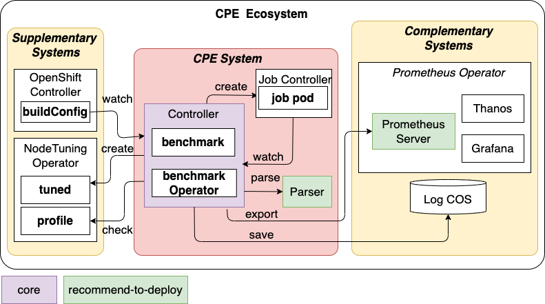

## CPE Operator

CPE operator is a project that originally implements the AutoDECK framework. AutoDECK (**Auto**mated **DEC**larative Performance Evaluation and Tuning Framework on **K**ubernetes) is an evaluation system of Kubernetes-as-a-Service (KaaS) that automates configuring, deploying, evaluating, summarizing, and visualizing benchmarking workloads with a fully declarative manner. 



#### Objectives
- deploy a benchmark from standardized custom resource
- automatically track new version of benchmarks
- optionally insert side car metrics collector to the benchmark job
- export monitoring metrics and parsed results to monitoring and analyzing platform (e.g., Prometheus, Grafana)

#### Roadmap
- [x] design custom resource; see [benchmark_types.go](api/v1/benchmark_types.go), [benchmarkoperator_types.go](api/v1/benchmarkoperator_types.go)
- [x] integrate to off-the-shelf benchmark operator; see [benchmarks](benchmarks/README.md)
- [x] implement build tracker; see [tracker](tracker/README.md)
- [x] raw output collector/parser; see [output](output/README.md)
  - [ ] integrate wrapper from [snafu](https://github.com/cloud-bulldozer/benchmark-wrapper/tree/master/snafu)
- [x] iteration support; see [iteration](iteration/README.md)
  - [x] app-parameter variation (scenario)
  - [x] spec configuration
  - [x] node profile tuning
- [x] visualize multi-cluster; see [multi-cluster](metric/README.md#multi-cluster-integration)
- [ ] insert a sidecar if set
- [ ] combine resource usage metric; see [metric](metric/README.md)
    - [x] prometheus-export metrics
    - [ ] app-export metrics
    - [ ] eBPF metric collector

## Build and Deploy Operator with dependencies

### 1. External Components
##### For monitoring and visualization (Monitoring System) - [read more](metric/README.md)
- Prometheus, ServiceMonitor Relabeling - core
- Prometheus's PushGateway - core
- Grafana - optional
- Thanos (Query, Sidecar, Store Gateway) - optional

##### For image tracking - [read more](https://docs.openshift.com/container-platform/4.7/rest_api/workloads_apis/buildconfig-build-openshift-io-v1.html)
- Build Operator - openshift platform

##### For node tuning - [read more](https://docs.openshift.com/container-platform/4.2/nodes/nodes/nodes-node-tuning-operator.html)
- Tuned Operator - openshift platform

### 2. Core module (Operator, Parser, Log COS)
- operator-sdk (>= 1.4)
- go (>= 1.13)

1. Clone the repo and enter the workspace
    ```bash
    git clone https://github.com/IBM/cpe-operator.git
    cd cpe-operator
    ```

2. Set IMAGE_REGISTRY to your registry and update image in kustomization.yaml
    ```bash
    export IMAGE_REGISTRY=[your registry URL]
    export VERSION=[your image version tag]
    envsubst < config/manager/kustomization_template.yaml > config/manager/kustomization.yaml
    ```
   ** VERSION value must be specified as a valid semantic version for operator-sdk (Major.Minor.Patch)

3. Prepare Cloud Object Storage for collecting output log
   
   3.1. Create new COS bucket on provider service (IBM COS: https://cloud.ibm.com/objectstorage/create)

   3.2. Create config secret for accessing COS
   ```yaml
    # cpe-cos-key-template.yaml
    apiVersion: v1
    kind: Secret
    metadata:
      name: cpe-cos-key
    type: Opaque
    stringData:
      rawBucketName: ${BUCKET_NAME}
      apiKey: ${APIKEY}
      serviceInstanceID: "${COS_ID}"
      authEndpoint: ${AUTH_ENDPOINT}
      serviceEndpoint: ${SERVICE_ENDPOINT}
   ```

   3.3. Update the value to `cpe-cos-key.yaml` with envsubst
   ```bash
    export BUCKET_NAME=[your bucket to store log]
    export APIKEY=[api key]
    export COS_ID=[instance ID] # crn:v1:...
    export AUTH_ENDPOINT=[authentication endpoint] # https://iam.cloud.ibm.com/identity/token
    export SERVICE_ENDPOINT=[service endpoint] # e.g., s3.jp-tok.cloud-object-storage.appdomain.cloud
    envsubst < cpe-cos-key-template.yaml > cpe-cos-key.yaml
   ```
4. Prepare secret folder and update `config/manager/manager.yaml`

   ```bash
   # 1. create secret folder under config
   mkdir config/secret
   # 2. put your secret files there (for example, secret.yaml)
   #    secret file includes image pull secret and api-key secret for COS connection
   cp image-pull-secret.yaml config/secret/image-pull-secret.yaml
   cp cpe-cos-key.yaml config/secret/cpe-cos-key.yaml 
   # 3. create kustomization.yaml and list the secret yamls
   cat <<EOF > config/secret/kustomization.yaml
   resources:
   - image-pull-secret.yaml
   - cpe-cos-key.yaml
   EOF
   ```
  * Update the pull secret name in the manager deployment `config/manager/manager.yaml` 
    * `.spec.template.spec.imagePullSecrets` = `.metadata.name` of `image-pull-secret.yaml`
5. Make bundle
    ```bash 
    go mod tidy
    make bundle
    ```
6. Build and push operator to your image registry
    ```bash
    make docker-build docker-push
    ```
7. Clone, Build and Push parser to the registry
    ```bash
    cd cpe-parser
    chmod +x build_push.sh
    # If you want to deploy to different registry, need to set target IMAGE_REGISTRY and VERSION
    # export IMAGE_REGISTRY=[parser registry URL]
    # export VERSION=[parser image version tag]
    ./build_push.sh
    ```
8. Deploy prometheus and pushgateway (if not exist); refer to step 1-3 in [metric](metric/README.md)
9.  Update image and pull secret key in config manifest
    ```bash
    export PUSHGATEWAY_URL=[pushgateway svc].[pushgateway namespace]:[pushgateway port]
    export COS_SECRET=[cos secret name]
    export PULL_SECRET=[image pull secret name]
    ```
10. Deploy the operator
    ```bash
    # This will update environment, then deploy secret, parser, and operator
    make deploy

    # confirm cpe operator is running
    kubectl get po -n cpe-operator-system
    # see manager log
    kubectl logs $(kubectl get po -n cpe-operator-system|grep controller|tail -1|awk '{print $1}') -n cpe-operator-system -c manager
    ```
To remove this operator run 
```bash
make undeploy
```

Restart
```bash
kubectl delete pod $(kubectl get po -n cpe-operator-system|grep controller|tail -1|awk '{print $1}') -n cpe-operator-system
```

## Operators and Benchmark

Current sample operators and benhmarks
Operator|Job Resource|Benchmarks
---|---|---
[Benchmark Operator (Ripsaw)](https://github.com/cloud-bulldozer/benchmark-operator)| ripsaw.cloudbulldozer.io/v1alpha1/Benchmark |Iperf3 <br> Sysbench
[Cockroach Operator (Cockroach DB)](https://github.com/cockroachdb/helm-charts)| batch/v1/Job | TPC-C
[MPI Operator](https://github.com/kubeflow/mpi-operator)|kubeflow.org/v1alpha2/MPIJob| OSU, Gloo
[Ray Operator (Ray Cluster)](https://github.com/ray-project/ray)| batch/v1/Job | Codait NLP
None (No Operator)| batch/v1/Job | CoreMark <br> FIO

Example: to run benchmark operator
```bash
kubectl create -f benchmarks/benchmark_operator/cpe_v1_benchmarkoperator_helm.yaml
# confirm ripsaw operator is running
kubectl get po -n my-ripsaw
kubectl create -f benchmarks/benchmark_operator/cpe_v1_benchmark_iperf3.yaml
# confirm the job
kubectl get po -n my-ripsaw
```
